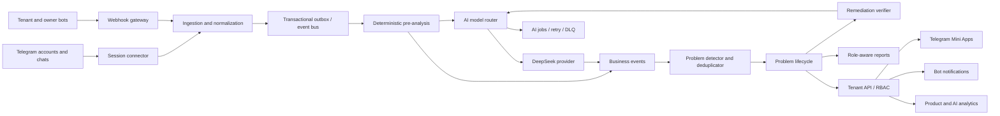
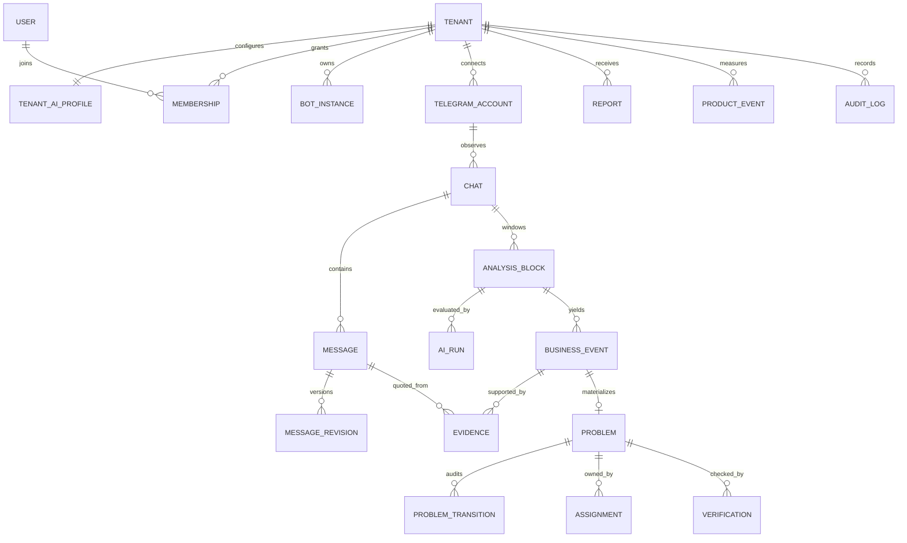
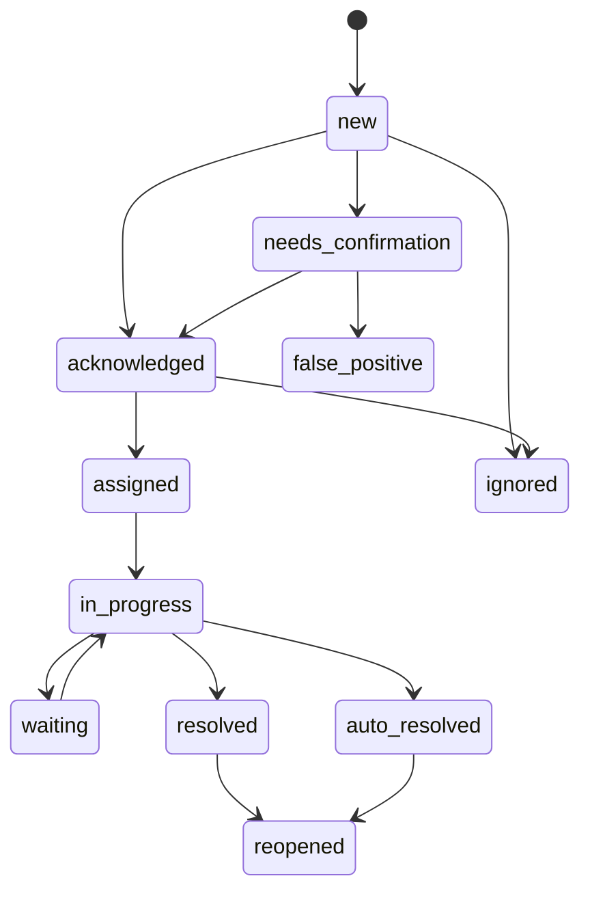

# Telegram Operations Intelligence — product and architecture

## 1. Product definition

The product is an operational control layer over a company's existing Telegram work. It detects lost enquiries, unfulfilled commitments, overdue follow-ups, complaints and revenue risks, turns each supported finding into an owned problem, and verifies that the underlying conversation actually changed before closure.

It is not a CRM, shared inbox, script grader, employee surveillance tool, or message counter. The product promise is: keep working in Telegram; the system finds execution gaps, assigns ownership and proves whether they were fixed.

## 2. Competitive difference

The primary unit is not a message or an AI score. It is a **problem with evidence and a lifecycle**. Every material conclusion links to source messages, context, author, time, rationale, confidence, impact and recommended action. Human feedback changes future routing and suppression rules; it never silently rewrites evidence.

The defensible loop is:

1. observe an operational event;
2. establish evidence and confidence;
3. convert it to a controlled problem;
4. assign an owner and deadline;
5. observe the following Telegram conversation;
6. verify remediation;
7. retain the immutable audit trail and measured outcome.

## 3. Architecture



The MVP is a single-server modular monolith backed by one SQLite database in WAL mode. FastAPI, the owner bot and one background worker are separate processes sharing the same local volume. FSM and jobs are durable SQLite tables; short transactions, a busy timeout and bounded write concurrency protect the single-writer design. PostgreSQL and Redis are explicit future scale transitions, not MVP dependencies.

## 4. Monorepo structure

```text
app/                         Mini App product surface (owner/client views)
services/api/                FastAPI application and contracts
packages/ops_core/           dependency-light domain and AI routing core
tests/                       domain and rendered UI tests
docs/                        product, architecture and operations decisions
infra/                       local and deployment configuration
db/, drizzle/                Sites preview persistence (not tenant source of truth)
```

Production extraction boundaries are `telegram-connector`, `analysis-worker`, `report-worker` and `notification-worker`. They remain modules until throughput or security isolation justifies separate deployment.

## 5. Data model

All tenant-owned rows carry `tenant_id`; application authorization and tenant-scoped repositories enforce isolation in the SQLite MVP. UUIDs are stored as 36-character strings. Telegram numeric identifiers are strings at API boundaries to avoid JavaScript precision loss.

Core entities:

- `tenant`, `tenant_ai_profile`, `tenant_limit`, `department`, `user`, `membership`, `role_scope`;
- `bot_instance`, `telegram_session`, `telegram_account`, `chat`, `chat_scope`, `message`, `message_revision`;
- `analysis_block`, `analysis_job`, `ai_run`, `prompt_version`, `business_event`, `evidence`;
- `problem`, `problem_transition`, `assignment`, `commitment`, `verification`;
- `report`, `report_delivery`, `product_event`, `audit_log`, `suppression_rule`;
- MVP infrastructure: `fsm_state`, `background_job`.



`message` can retain ciphertext, redacted text, or no text according to policy. Evidence stores the minimum approved quotation and a source fingerprint. Financial fields distinguish mentioned, potential, quoted, expected, customer-claimed and externally-confirmed values.

## 6. Problem lifecycle



Closure requires either human confirmation or verification evidence. An automated close records the verifier version, source message IDs and confidence. Illegal transitions are rejected by the domain layer, not merely hidden in the UI.

## 7. AI pipeline

1. Normalize and version only new/edited messages.
2. Apply chat scopes, retention rules, redaction and deterministic calculations.
3. Build a bounded incremental block from new messages, relevant neighbours and summary memory.
4. Hash `(tenant context version, prompt version, analyzer, normalized block)` for idempotency/cache.
5. Route by task, complexity, participants, contradiction, risk, value, budget and tenant feedback.
6. Validate JSON against the analyzer schema. One repair is allowed; repeated invalid results go to the DLQ and create no problem.
7. Persist the structured result, short rationale, evidence, model/mode/version, usage, cost and latency. Never persist chain-of-thought.
8. Escalate only low-confidence, contradictory, critical, high-value or tenant-sensitive findings.
9. Deduplicate and correlate events before creating a problem.
10. Re-run a narrow verifier after later relevant messages.

Routes are `fast` (Flash/non-thinking), `balanced` (Flash/thinking), `deep` (Pro/high), and `critical` (Pro/max). Model IDs live in configuration and are checked against `GET /models` at startup when a key is available. On 2026-08-04 the official documentation lists `deepseek-v4-flash` and `deepseek-v4-pro`; runtime discovery remains authoritative.

## 8. Tenant creation scenario

The owner bot runs a resumable wizard grouped into company, process vocabulary, operational thresholds, privacy scope, reports, commercial limits and AI instructions. Each step validates and writes a draft. Preview shows derived `tenant_ai_profile`; explicit confirmation activates the tenant. Sensitive values are never part of the profile. Every change is versioned and audited.

## 9. Tenant bot release scenario

Select tenant → submit BotFather token through a one-time sensitive form → call `getMe` → encrypt with envelope encryption → create bot instance → generate webhook secret → register webhook → bind Mini App → assign tenant owner → send test message → display deep link. Rotation creates a new ciphertext version and invalidates the previous token after webhook verification. Health, errors and activity are retained without token material.

## 10. Owner bot

Commands: platform status, tenant wizard/resume, bot issue/rotate/disable, incident alerts, budget alerts, report delivery and a signed Mini App launch. Destructive operations require typed confirmation and step-up authentication.

## 11. Owner Mini App

Surfaces: platform overview, tenants, bot/session health, subscriptions and limits, AI routing/cost/quality, prompt versions, product adoption, errors/DLQ, security/audit and configuration. There is one platform-owner role; no redundant SaaS administrator role.

## 12. Tenant bot

Provides role-specific digests, critical alerts, assignments, deadline reminders, quick feedback, problem deep links, reports and secure Mini App launch. It does not reproduce an inbox or disclose chats outside scope.

## 13. Tenant Mini App

Mobile-first navigation: Home, Attention, Problems, Dialogues, Clients, Employees, Commitments, Meetings, Pipeline, Finance, Reports, System problems, Telegram accounts, Settings and Security. The first viewport prioritizes “what needs management attention” over volume metrics. Role-specific filters are server-enforced.

## 14. RBAC

| Role | Scope | Capabilities |
|---|---|---|
| Platform owner | all tenants, audited | provision, configure, suspend, inspect platform metadata |
| Tenant owner | own tenant | all tenant data and settings except platform secrets |
| Department head | assigned scopes | read/manage problems, staff and reports in assigned departments/processes |
| Employee | self | own problems, commitments, actions, recommendations and statistics |
| Observer | selected reports | read-only, no source text unless explicitly granted |

Authorization evaluates `(actor, tenant, resource, action, scope)` on every request. Telegram `initData` is verified server-side; the client cannot choose its role or tenant.

## 15. API endpoints

Versioned prefix: `/api/v1`.

- `POST /auth/telegram/exchange`, `GET /me`;
- `POST /owner/tenants`, `PATCH /owner/tenants/{id}`, `POST /owner/tenants/{id}/activate`;
- `POST /owner/tenants/{id}/bots`, `POST /bots/{id}/rotate`, `POST /bots/{id}/webhook`, `GET /bots/{id}/health`;
- `POST /telegram/sessions/challenge`, `POST /telegram/sessions/confirm`, `DELETE /telegram/sessions/{id}`;
- `GET/PATCH /chat-scopes`, `POST /ingestion/updates` (internal, idempotent);
- `GET /dashboard`, `GET /attention`, `GET /problems`, `GET /problems/{id}`;
- `POST /problems/{id}/confirm`, `/reject`, `/assign`, `/start`, `/resolve`, `/reopen`;
- `GET /dialogues/{id}`, `GET /commitments`, `GET /reports`, `POST /reports/{id}/export`;
- `POST /events/product`, `POST /feedback/ai`;
- `GET /owner/analytics/adoption`, `/ai`, `/errors`, `/audit`;
- `GET/PATCH /settings/security`, `/settings/ai-profile`, `/settings/limits`;
- `GET /health/live`, `/health/ready`, `/metrics`.

Mutation endpoints accept `Idempotency-Key`; cursor pagination is mandatory for message/problem feeds. Errors use stable machine codes and correlation IDs.

## 16. Product events

The canonical events are the requested bot, Mini App, section, problem, dialogue, report, account, feedback, subscription and payment actions. Common envelope: `event_id`, `tenant_id`, `actor_id`, `session_id`, `event_name`, `occurred_at`, `surface`, `object_type/id`, `properties`, `app_version`. Properties are allow-listed and must not contain message text, tokens or session strings. Server-side events are authoritative for confirmation, assignment, resolution, payment and exports.

## 17. Security design

- Data minimization and explicit chat/account scope precede ingestion.
- Bot tokens and Telegram sessions use per-record data keys wrapped by KMS; session service has separate identity and database permissions.
- TLS in transit, encrypted volumes/backups, field-level encryption for sensitive values, automatic key rotation.
- Application RBAC and tenant-scoped repositories; tenant ID comes from verified identity, never request input alone. PostgreSQL RLS is a future hardening step when the system outgrows single-server SQLite.
- Log redaction by default; security tests contain canary secrets to detect leakage.
- Configurable retention, text-after-analysis deletion and cryptographic erasure of tenant keys.
- Immutable append-only audit for access, exports, scope changes, token/session operations and administrative actions.
- SSRF-safe media retrieval, malware scanning, size/type limits and isolated parsers.
- Webhook secrets, replay windows, idempotency, rate limiting, circuit breakers and least privilege.
- DeepSeek receives only the minimum redacted context under a no-general-training contractual setting; secrets never enter prompts.

## 18. Delivery plan

1. Foundation: identity, tenant-scoped RBAC, audit, SQLite persistence, durable FSM/jobs and observability.
2. Secure Telegram connection, chat scopes, normalized incremental ingestion.
3. Deterministic detectors, provider abstraction, DeepSeek router, schemas, budgets and DLQ.
4. Event correlation, problem state machine, evidence view, assignment and remediation verification.
5. Tenant bot and Mini App attention/problem workflows.
6. Daily reports and owner provisioning/health/AI-cost surfaces.
7. Product analytics, false-positive learning, weekly/role reports and value measurement.
8. Security review, load/failure tests, recovery exercise and controlled pilot.

## 19. Technical risks

- Telegram user-session compliance and account bans: explicit customer authorization, conservative rate limits, connector isolation and legal review.
- AI false positives: deterministic gates, confidence thresholds, cascade verification, evidence, feedback and suppression.
- Tenant leakage: scoped repositories, adversarial authorization tests and export audits; add PostgreSQL RLS during the multi-server transition.
- Cost spikes: incremental hashes, budget reservations, bounded context, cached summaries and Pro quotas.
- Missed or duplicate updates: idempotent source keys, revisions, outbox, checkpoint reconciliation and replay.
- Prompt injection in chats: treat message text as untrusted data, fixed system policies, schema validation and no tools in analyzers.
- Ambiguous remediation: require later evidence and preserve human override/reopen.
- Reporting claims: label inferred value separately from externally confirmed revenue.

## 20. MVP readiness criteria

The 28 requested acceptance points are grouped into seven testable journeys: tenant/bot provisioning; client activation and Telegram scope; loss/promise/follow-up/meeting/complaint analysis; evidenced problem creation; assignment and verified remediation; daily delivery; platform adoption/feedback/cost visibility with tenant isolation.

Release additionally requires: zero cross-tenant authorization failures in automated tests; encrypted secret verification; replay-safe ingestion; schema-invalid output never creates problems; queue recovery after provider outage; restore drill within agreed RPO/RTO; and documented human fallback for critical alerts.

## 21. Decisions for the first implementation slice

The repository implements the domain state machine and router as a dependency-light core so they can be exhaustively tested. FastAPI is an adapter, not the owner of business rules. The current Foundation uses real SQLite persistence, encrypted Telegram bot credentials, persistent FSM and a single durable job worker. The Mini App remains representative and disconnected. Real Telegram user-session connector activation remains disabled until its dedicated security phase.
